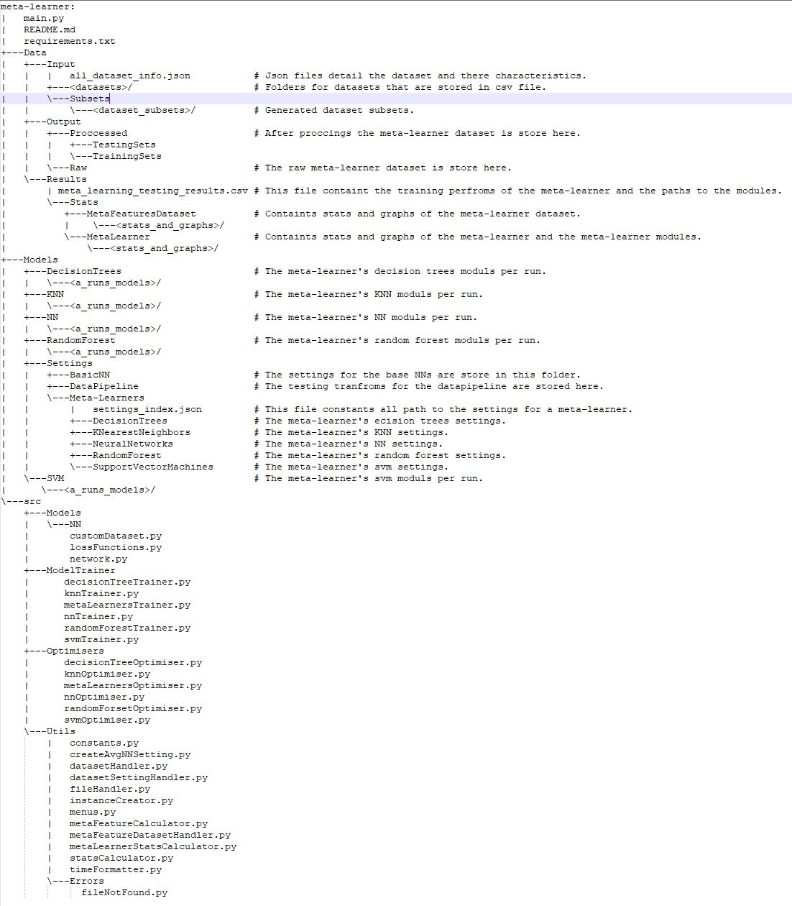

# Learning to Regularise: Meta-Learning of Neural Network Regularisation Strategies

## Overview
This project creates a meta feature dataset and uses this dataset to create a predictor which predicts the best performing regularisation technique for a dataset.

## Features
- Modular neural networks, decision trees, random forests, and SVMs.
- Training and optimisation for various models.
- Dataset creation and statistics calculation utilities.
- Menu-driven interface for easy experimentation.
- Support for CUDA-enabled hardware.

## Installation
1. Clone the repository:
   ```powershell
   git clone https://github.com/Christo08/meta-learning-regularisation-strategies.git
     ```
2. Install dependencies:
   ```powershell
   pip install -r requirements.txt
   ```

## Usage
Run the main program:
```powershell
python main.py
```
The main menu contains the following options:
- Optimise NN: Obtain the optimised hyperparameters for a NN trained on an input dataset. NN created using this feature will be used to form the target columns.
- Create Subsets and Instances: Create subsets of the input datasets and instances from the created subsets for meta learning dataset. An instance consists of the meta features of the subset, the meta features if the NN and the performance of each of the regularisation techniques for the subset.
- Recreate Subsets:  Recreate subsets for a given seed.
- Recreate instances: Recreate instances for a given seed and subset.
- Get Statistics of Meta Learning Dataset: Obtain the statistics of the meta learning dataset, including the distribution of meta features and target values, and create charts of the dataset
- Optimise Meta Learning: Obtain the optimised hyperparameters for meta learner's modules.
- Train Meta Learning: Train the meta learner's modules using the created meta learning dataset and save the results to a file.
- Get Statistics of Meta Learners Results: Obtain the statistics of the meta learners performance, more specifically create charts comparing the performances of each of the meta learners for every regularisation technique.
- Test meta learning: Test the meta learner's performance on a test set and save the results to a file.
- Get statistics of meta learners performance: Obtain the statistics of the meta learners performance on the test set, more specifically create charts comparing the performances of each of the meta learners for every regularisation technique on the test set.
- Exit: Exit the program.
## Project Structure


## Adding New Datasets
1. Place the dataset in `Data/Datasets/Input/` with a unique name. Skip this step if the dataset is import from libraries such as pmlb or others.
2. Update the all_datasets.json file with the following details:
   - `name`: Unique name of the dataset.
   - `type`: Source of the dataset. Currently only "csv" and "pmlb" datatsets are supported. csv is for downloaded datasets and pmlb is for datasets obtained from the pmlb library.
   - `category_columns`: List of categorical columns in the dataset.
   - `target_column`: The name of the target column in the dataset.
   - `drop_columns`: List of columns to drop from the dataset.
   - `file_path`: The path to the dataset's file if the dataset is a csv file. Skip this field if the dataset is from a library.
   - `pmlb_name`: The name of the dataset in the pmlb library. This field is only required if the dataset is from the pmlb library.
## Dependencies
See `requirements.txt` for a full list. Key packages:
- PyTorch
- scikit-learn
- numpy,
- pandas
- matplotlib, 
- seaborn
- imbalanced-learn
- networkx

## Authors
- Christiaan P. Opperman